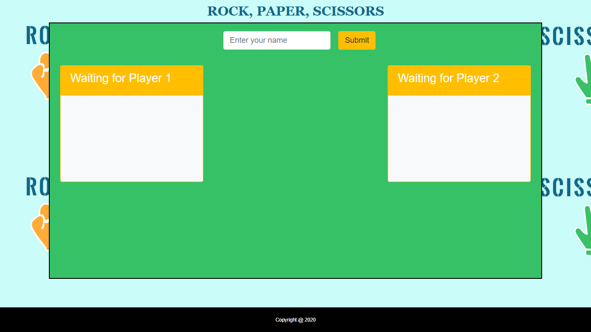

File 

# RPS-Multiplayer

Description

1. Link to play the game: https://shruti-gaonkar.github.io/RPS-Multiplayer/

  * Landing page

  

  * Only two players can play at the same time.

  * Both players pick either `rock`, `paper` or `scissors`. After the players make their selection, the game tells them whether a tie occurred or if one player defeated the other.

  
  
  

  * After each win or lose, the results clear in few seconds and the player can play again.

  * The game tracks each player's wins and losses.

  * There is a chat functionality for both the players to send messages during the game. If one player gets disconnected it shows a message to the other player.

  * If there are more than 2 players it shows a message to the new user that he cannot play.

Technologies
HTML, CSS, JQuery, Javascript, Firebase